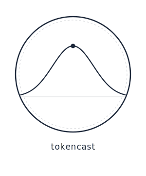

<p align="center">
  
</p>

[](https://github.com/krulewis/tokencast/actions/workflows/ci.yml)
[](https://pypi.org/project/tokencast/)

<!-- mcp-name: io.github.krulewis/tokencast -->

# tokencast

Pre-execution cost estimation for LLM agent workflows. Get a cost estimate before running any agent task, then let tokencast learn from actuals to improve accuracy over time.

Available as a **Claude Code plugin** (recommended — one command delivers everything) or as an **MCP server** for Cursor, VS Code + Copilot, and Windsurf.

---

## Installation

### Claude Code (Recommended)

Install tokencast as a Claude Code plugin — delivers the MCP server, calibration hooks, and estimation skill in two commands:

```
/plugin marketplace add krulewis/tokencast
/plugin install tokencast@tokencast
```

The first command registers the tokencast marketplace. The second installs the plugin
from it.

> **Prerequisites:** [`uv`](https://docs.astral.sh/uv/) must be installed for the MCP server to function.
> Install with: `curl -LsSf https://astral.sh/uv/install.sh | sh`

This delivers:
- **MCP server** (`estimate_cost`, `get_calibration_status`, `get_cost_history`, `report_session`, `report_step_cost`)
- **Calibration hooks** (auto-learning at session end, mid-session cost warnings, agent timeline tracking)
- **SKILL.md** (estimation algorithm auto-trigger after plans)

Calibration data is stored in `~/.tokencast/calibration/` (global across projects, preserved on uninstall).

> **Scope options:** `--scope user` (recommended — installs globally for all projects) or `--scope project` (per-project only).

### Other IDEs (MCP Server)

Install the package:

```bash
pip install tokencast
```

Or with `uvx` (no install required — runs directly from PyPI):

```bash
uvx tokencast
```

Configure your IDE — replace `/path/to/your/project` with your actual project path in the config snippets below.

#### Cursor

Create or update `.cursor/mcp.json` in your project root:

```json
{
  "mcpServers": {
    "tokencast": {
      "command": "tokencast-mcp",
      "args": [
        "--calibration-dir", "/path/to/your/project/calibration",
        "--project-dir", "/path/to/your/project"
      ]
    }
  }
}
```

#### VS Code + GitHub Copilot

Create or update `.vscode/mcp.json` in your project root:

```json
{
  "servers": {
    "tokencast": {
      "type": "stdio",
      "command": "tokencast-mcp",
      "args": [
        "--calibration-dir", "/path/to/your/project/calibration",
        "--project-dir", "/path/to/your/project"
      ]
    }
  }
}
```

#### Windsurf

Add to your Windsurf MCP config:

```json
{
  "mcpServers": {
    "tokencast": {
      "command": "tokencast-mcp",
      "args": [
        "--calibration-dir", "/path/to/your/project/calibration",
        "--project-dir", "/path/to/your/project"
      ]
    }
  }
}
```

Full config examples are in [`docs/ide-configs/`](docs/ide-configs/).

#### Available tools

Once configured, tokencast exposes five MCP tools in your IDE:

| Tool | What it does |
|------|-------------|
| `estimate_cost` | Estimate API cost for a planned task before running it |
| `get_calibration_status` | Check whether your estimates are well-calibrated |
| `get_cost_history` | Browse past estimates vs actuals |
| `report_session` | Report actual cost at session end to improve calibration |
| `report_step_cost` | Record the cost of a single pipeline step during a session |

**Example — estimate before starting work:**
```
Estimate the cost for: size=M, files=8, complexity=high
```

**Example — report actuals after finishing:**
```
Report session cost: actual_cost=4.20
```

---

## MCP Server Flags

| Flag | Default | Description |
|------|---------|-------------|
| `--calibration-dir PATH` | `~/.tokencast/calibration` | Where calibration data is stored |
| `--project-dir PATH` | None | Project root for file measurement |
| `--telemetry` | Off | Enable anonymous usage telemetry (see below) |
| `--version` | | Print version and exit |

---

## Telemetry

tokencast includes **opt-in** anonymous usage telemetry. It is **off by default** — no data is sent unless you explicitly enable it.

**To enable:** add `--telemetry` to the MCP server command, or set `TOKENCAST_TELEMETRY=1`.

**To disable:** remove the `--telemetry` flag or unset `TOKENCAST_TELEMETRY=1`. To delete your install ID: `rm ~/.tokencast/install_id`.

**What is collected:** session count, mean accuracy ratio, calibrated factor count, client name, framework, tool name, package version. **What is NOT collected:** project names, file paths, cost amounts, or any personal data.

Data is sent to [PostHog](https://posthog.com) (US region). A random UUID is generated locally as your install ID — it contains no personal information. See the [wiki](https://github.com/krulewis/tokencast/wiki/Configuration#telemetry) for full details.

---

## Claude Code Skill (Legacy)

The Claude Code plugin (recommended) delivers everything in one command. Use this only if you prefer the SKILL.md workflow without the plugin system.

If you use Claude Code and prefer the skill-based (SKILL.md) workflow, you can install tokencast as a Claude Code skill instead:

```bash
# Clone the repo (anywhere — it doesn't need to live inside your project)
git clone https://github.com/krulewis/tokencast.git

# Install into your project (quote paths with spaces)
bash tokencast/scripts/install-hooks.sh "/path/to/your-project"
```

> **Paths with spaces:** Always wrap the project path in quotes. Without them the install script will fail on paths like `/Volumes/Macintosh HD2/...`.

This does three things:
1. Symlinks the skill into `<project>/.claude/skills/tokencast/`
2. Adds a `Stop` hook for auto-learning at session end
3. Adds a `PostToolUse` hook to nudge estimation after planning agents

The SKILL.md workflow is Claude Code-specific. The MCP server works in any MCP-compatible client and is the recommended path for new users.

---

## How It Works

1. Infers size, file count, complexity from the plan in conversation
2. Reads reference files for pricing and token heuristics
3. Loads learned calibration factors (if any exist)
4. Computes per-step token estimates using activity decomposition
5. Applies complexity multiplier, context accumulation `(K+1)/2`, and cache rates
6. Splits into Optimistic / Expected / Pessimistic bands
7. If PR Review Loop is in scope, computes loop cost using geometric decay across N review cycles
8. Applies calibration correction to Expected band
9. Records the estimate for later comparison with actuals

**Example output:**

```
## tokencast estimate

Change: size=M, files=5, complexity=medium
Calibration: 1.12x from 8 prior runs

| Step                  | Model  | Optimistic | Expected | Pessimistic |
|-----------------------|--------|------------|----------|-------------|
| Research Agent        | Sonnet | $0.60      | $1.17    | $4.47       |
| Architect Agent       | Opus   | $0.67      | $1.18    | $3.97       |
| ...                   | ...    | ...        | ...      | ...         |
| TOTAL                 |        | $3.37      | $6.26    | $22.64      |
```

---

## Confidence Bands

| Band        | Cache Hit | Multiplier | Meaning                                |
|-------------|-----------|------------|----------------------------------------|
| Optimistic  | 60%       | 0.6x       | Best case — focused agent work         |
| Expected    | 50%       | 1.0x       | Typical run                            |
| Pessimistic | 30%       | 3.0x       | With rework loops, debugging, retries  |

---

## Calibration

Calibration is fully automatic once you report actuals:
- **0-2 sessions:** No correction applied. "Collecting data" status.
- **3-10 sessions:** Global correction factor via trimmed mean of actual/expected ratios (trim_fraction=0.1).
- **10+ sessions:** EWMA with recency weighting. Per-size-class factors activate when a class has 3+ samples.
- **Outlier filtering:** Sessions with actual/expected ratio >3.0x or <0.2x are excluded from calibration.

Calibration data lives in `~/.tokencast/calibration/` (gitignored, local to each user).

---

## Python API

```python
from tokencast import estimate_cost, report_session, report_step_cost
from tokencast import get_calibration_status, get_cost_history

# Estimate before running a task
result = estimate_cost(
    {"size": "M", "files": 5, "complexity": "medium"},
    calibration_dir="./calibration",
)

# Report actuals at session end
report_session({"actual_cost": 4.20}, calibration_dir="./calibration")

# Check calibration health
status = get_calibration_status({}, calibration_dir="./calibration")

# Browse history
history = get_cost_history({"window": "30d"}, calibration_dir="./calibration")

# Report a single step's cost
report_step_cost(
    {"step_name": "Research Agent", "cost": 0.85},
    calibration_dir="./calibration",
)
```

---

## Manual Invocation (Skill mode)

In Claude Code with SKILL.md installed, you can invoke explicitly:

```
/tokencast size=L files=12 complexity=high
/tokencast steps=implement,test,qa
/tokencast review_cycles=3
/tokencast review_cycles=0
```

---

## Files

```
SKILL.md                        — Skill definition (auto-trigger, algorithm)
references/pricing.md           — Model prices, cache rates, step→model map
references/heuristics.md        — Token budgets, pipeline decompositions, multipliers
references/examples.md          — Worked examples with arithmetic
references/calibration-algorithm.md — Detailed calibration algorithm reference
docs/ide-configs/               — Per-IDE MCP config examples
src/tokencast/                  — Core estimation engine (Python package)
src/tokencast_mcp/              — MCP server (Python package)
scripts/
  install-hooks.sh              — One-time project setup (skill mode)
  disable.sh                    — Remove from project (skill mode)
  tokencast-learn.sh            — Stop hook: auto-captures actuals (skill mode)
  tokencast-track.sh            — PostToolUse hook: nudges estimation after plans
  sum-session-tokens.py         — Parses session JSONL for actual costs
  update-factors.py             — Computes calibration factors from history
calibration/                    — Per-user local data (gitignored)
  history.jsonl                 — Estimate vs actual records
  factors.json                  — Learned correction factors
  active-estimate.json          — Transient marker for current estimate
```

---

## Limitations

- Pipeline step names reflect a default workflow — map your own steps to the closest defaults. Formulas are pipeline-agnostic (see `references/heuristics.md`)
- Heuristics assume typical 150-300 line source files
- Calibration requires 3+ completed sessions before corrections activate
- Pricing data embedded; check `last_updated` in references/pricing.md
- Multi-session tasks only capture the session containing the estimate

---

## License

MIT
