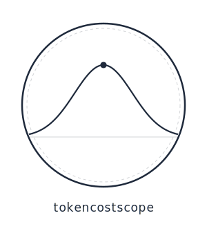

<p align="center">
  
</p>

# tokencostscope

A Claude Code skill that estimates Anthropic API cost for planned agent tasks, then **learns from actual usage** to improve estimates over time.

Install once per project. It auto-estimates after plans are created and auto-learns at session end. Zero ongoing friction.

## Setup (one time per project)

```bash
# Clone the repo (anywhere — it doesn't need to live inside your project)
git clone https://github.com/krulewis/tokencostscope.git

# Install into your project (quote paths with spaces)
bash tokencostscope/scripts/install-hooks.sh "/path/to/your-project"
```

> **Paths with spaces:** Always wrap the project path in quotes. Without them the install script will fail on paths like `/Volumes/Macintosh HD2/...`.

This does three things:
1. Symlinks the skill into `<project>/.claude/skills/tokencostscope/`
2. Adds a `Stop` hook for auto-learning at session end
3. Adds a `PostToolUse` hook to nudge estimation after planning agents

Every Claude Code session in that project now has tokencostscope active.

## What Happens Automatically

### After a plan is created
tokencostscope detects the plan in conversation context, infers size, files, complexity, project type, and language, then outputs a cost table:

```
## tokencostscope estimate

Change: size=M, files=5, complexity=medium
Calibration: 1.12x from 8 prior runs

| Step                  | Model  | Optimistic | Expected | Pessimistic |
|-----------------------|--------|------------|----------|-------------|
| Research Agent        | Sonnet | $0.60      | $1.17    | $4.47       |
| Architect Agent       | Opus   | $0.67      | $1.18    | $3.97       |
| ...                   | ...    | ...        | ...      | ...         |
| TOTAL                 |        | $3.37      | $6.26    | $22.64      |
```

### At session end
The learning hook silently:
1. Reads the session's JSONL log
2. Computes actual token cost (including cache write tokens)
3. Compares to the estimate
4. Updates calibration factors

### Next session
Future estimates use learned correction factors. More sessions = better accuracy.

## Manual Invocation

You can also invoke explicitly with overrides:

```
/tokencostscope size=L files=12 complexity=high
/tokencostscope steps=implement,test,qa
/tokencostscope review_cycles=3
/tokencostscope review_cycles=0
```

Use `review_cycles=N` to set the number of expected PR review cycles. Use `review_cycles=0` to suppress the PR Review Loop row.

## How It Works

1. Infers size, file count, complexity from the plan in conversation
2. Reads reference files for pricing and token heuristics
3. Loads learned calibration factors (if any exist)
4. Computes per-step token estimates using activity decomposition
5. Applies complexity multiplier, context accumulation `(K+1)/2`, and cache rates
6. Splits into Optimistic / Expected / Pessimistic bands
7. If PR Review Loop is in scope, computes loop cost using geometric decay across N review cycles (Optimistic=1, Expected=N, Pessimistic=N×2)
8. Applies calibration correction to Expected band (individual steps re-anchor; PR Review Loop scales each band independently)
9. Records the estimate for later comparison with actuals

## Overrides

| Override | Effect |
|----------|--------|
| `size=M` | Set size class explicitly |
| `files=5` | Set file count explicitly |
| `complexity=high` | Set complexity explicitly |
| `steps=implement,test,qa` | Estimate only those pipeline steps |
| `project_type=migration` | Set project type explicitly |
| `language=go` | Set primary language explicitly |
| `review_cycles=3` | Set PR review cycle count (0 = disable) |

## Confidence Bands

| Band        | Cache Hit | Multiplier | Meaning                                |
|-------------|-----------|------------|----------------------------------------|
| Optimistic  | 60%       | 0.6x       | Best case — focused agent work         |
| Expected    | 50%       | 1.0x       | Typical run                            |
| Pessimistic | 30%       | 3.0x       | With rework loops, debugging, retries  |

## Calibration

Calibration is fully automatic:
- **0-2 sessions:** No correction applied. "Collecting data" status.
- **3-10 sessions:** Global correction factor via trimmed mean of actual/expected ratios (trim_fraction=0.1).
- **10+ sessions:** EWMA with recency weighting. Per-size-class factors activate when a class has 3+ samples.
- **Outlier filtering:** Sessions with actual/expected ratio >3.0x or <0.2x are excluded from calibration and logged for inspection.

Calibration data lives in `calibration/` (gitignored, local to each user).

## Disabling

```bash
bash /path/to/tokencostscope/scripts/disable.sh /path/to/your-project
```

Removes the skill and hooks. Preserves calibration data for reuse.

## Files

```
SKILL.md                        — Skill definition (auto-trigger, algorithm)
references/pricing.md           — Model prices, cache rates, step→model map
references/heuristics.md        — Token budgets, pipeline decompositions, multipliers
references/examples.md          — Worked examples with arithmetic
references/calibration-algorithm.md — Detailed calibration algorithm reference
commands/
  tokencostscope-version.md     — /tokencostscope-version slash command
scripts/
  install-hooks.sh              — One-time project setup
  disable.sh                    — Remove from project
  tokencostscope-learn.sh       — Stop hook: auto-captures actuals
  tokencostscope-track.sh       — PostToolUse hook: nudges estimation after plans
  sum-session-tokens.py         — Parses session JSONL for actual costs
  update-factors.py             — Computes calibration factors from history
calibration/                    — Per-user local data (gitignored)
  history.jsonl                 — Estimate vs actual records
  factors.json                  — Learned correction factors
  active-estimate.json          — Transient marker for current estimate
```

## v1.1 Changes

- **Trimmed mean** replaces median for faster convergence with small samples
- **Outlier flagging** — extreme ratios (>3.0x or <0.2x) excluded from calibration, logged for inspection
- **Richer data** — project type, language, pipeline signature, and step count captured per session
- **Baseline subtraction** — tokens spent before the estimate are excluded from actuals
- **Security hardening** — path injection fixes, consolidated parsing, safe handling of paths with spaces
- **Version markers** — `version: 1.1.0` in SKILL.md, `--version` flag on learn script

## Limitations

- Heuristics assume typical 150-300 line source files
- Does not model parallel agent execution
- Calibration requires 3+ completed sessions before corrections activate
- Pricing data embedded; check `last_updated` in references/pricing.md
- Multi-session tasks only capture the session containing the estimate

## License

MIT
